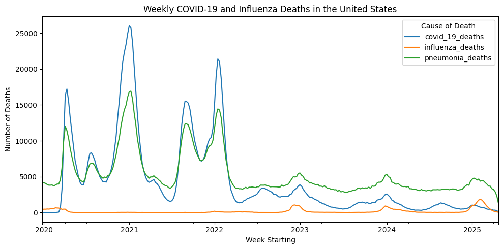
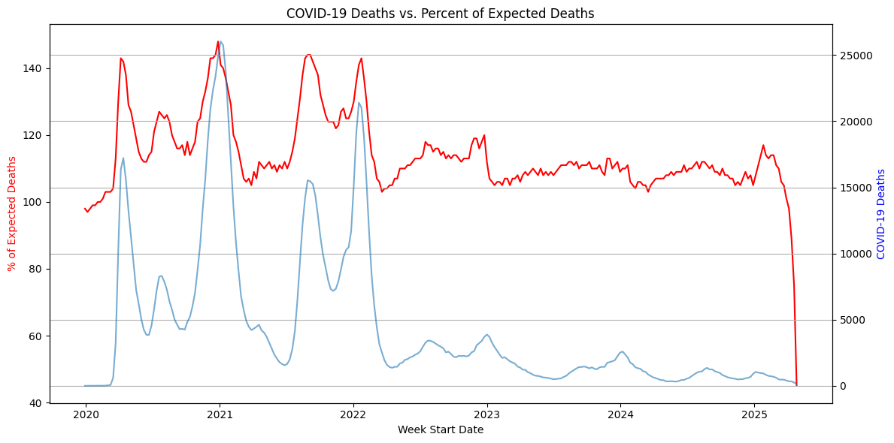
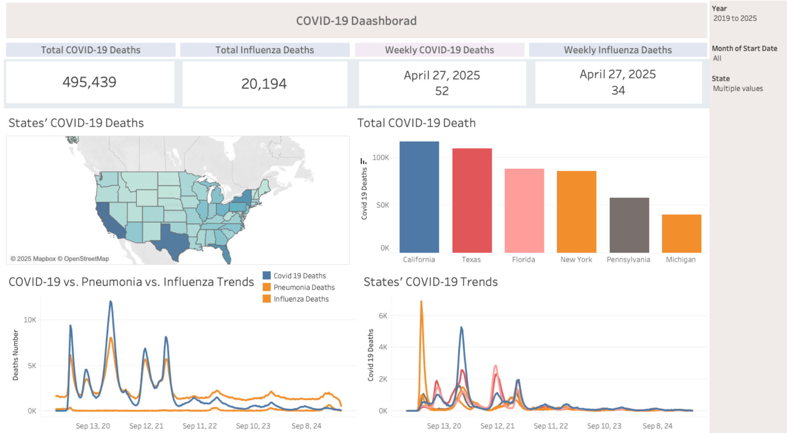
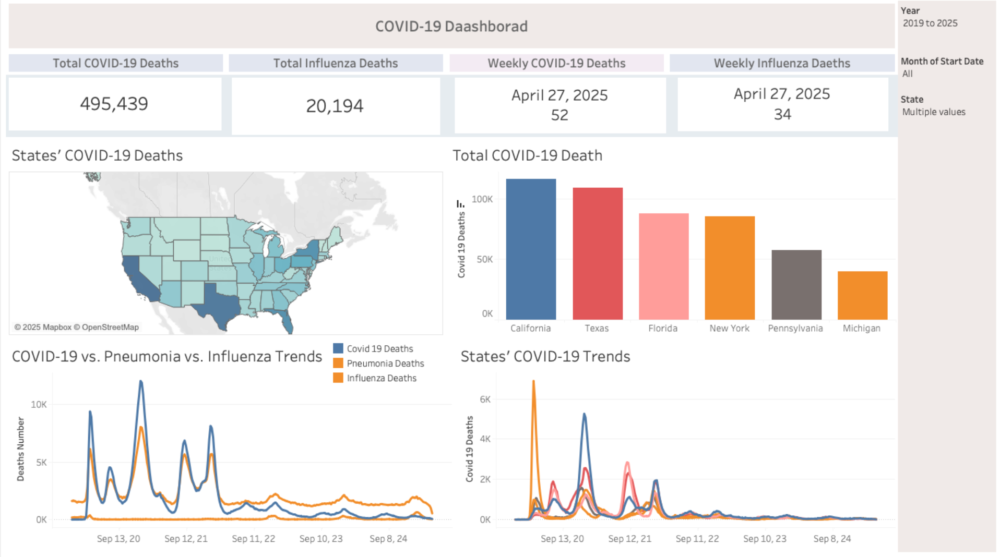

# COVID-19 Mortality Patterns Analysis

## Executive Summary
This project analyzes weekly COVID-19, pneumonia, and influenza deaths across U.S. states from 2020 to 2025, using CDC and Census data. Key goals include identifying mortality trends, examining geographic disparities, and uncovering patterns through clustering.

Strong correlations were found between COVID-19 and pneumonia deaths, with four major mortality peaks aligned across both causes. Influenza deaths showed no similar trend. The analysis revealed that excess deaths often exceeded expected levels, especially during COVID-19 surges, indicating systemic healthcare strain.

Geographic analysis showed that while populous states (California, Texas, Florida) had the highest total deaths, smaller states like West Virginia and Mississippi faced higher death rates relative to population. Clustering of states using K-Means revealed four distinct groups based on outbreak timing and severity, offering insights into regional vulnerabilities and response patterns.

These findings highlight the varied impact of COVID-19 across states and the importance of local context in public health planning and response.

## Project Overview
This project analyzes weekly mortality in each U.S. state, comparing COVID-19, pneumonia, and influenza. Identified peaks, correlations, and per-capita impacts to highlight geographic and temporal patterns.

This project applies clustering techniques to weekly COVID-19 death data in the United States to uncover patterns among states based on the severity and timing of outbreaks. By using unsupervised learning (K-Means), the analysis groups states with similar mortality trajectories, offering insights into regional vulnerabilities and trends. 

---

## Data Sources
- **CDC Provisional COVID-19 Death Counts**  
  https://data.cdc.gov/National-Center-for-Health-Statistics/Provisional-COVID-19-Death-Counts-by-Week-Ending-D/r8kw-7aab  

  - Data accessed via CDC API, providing weekly death counts by cause (COVID-19, pneumonia, influenza) and by state.

- **U.S. State Population Estimates (2019–2025)**  
   https://www.census.gov/data/datasets/time-series/demo/popest/2010s-state-total.html)  
   - Population data sourced from the U.S. Census Bureau (2019–2024). 2025 values were extrapolated using trend-based projections.

## Data Processing Pipeline
- Filtering: Retained only weekly data from the dataset by filtering on the group column.
Cleaning: Removed duplicates and converted date and numeric fields to proper types (datetime, float).
- Missing Values:
Death columns had notable missingness:
  - ~40% in pneumonia_influenza_or_covid_19_deaths and influenza_deaths
  - ~24% in total_deaths
  - ~8.5% in pneumonia_and_covid_19_deaths
  
The dataset uses a footnote column to flag suppressed values (fewer than 10 deaths).Where flagged, missing values were imputed with a random number between 1 and 9.
After imputation, no missing values remained in key death-related columns.

## Analysis & Visualizations
### Correlation between COVID-19 and Pneumonia
- COVID-19 and pneumonia deaths are highly correlated (r = 0.982).
- Influenza deaths show weak and negative correlation (r = -0.208), indicating a distinct trend.
- Four major peaks in both COVID-19 and pneumonia deaths occurred at nearly identical times:

| Peak | COVID-19 Peak | Deaths | Pneumonia Peak | Deaths |
| ---- | ------------- | ------ | -------------- | ------ |
| 1    | 2020-04-12    | 17,221 | 2020-04-05     | 12,015 |
| 2    | 2021-01-03    | 26,028 | 2021-01-10     | 16,923 |
| 3    | 2021-08-29    | 15,539 | 2021-09-05     | 12,356 |
| 4    | 2022-01-16    | 21,407 | 2022-01-16     | 14,443 |

### Geographic analysis
COVID-19's impact across the United States was far from uniform. Some states bore a significantly heavier burden than others in both total deaths and mortality rates relative to population. This analysis provides a clearer understanding of how geographic, demographic, and systemic factors contributed to that variation.

#### Most Affected States (COVID-19 Deaths)
The most populous states. California, Texas, and Florida also recorded the highest number of COVID-19 deaths. California alone reported over 116,000 deaths, followed closely by Texas (109,000+) and Florida (87,000+). These numbers reflect both large populations and periods of intense case surges. However, these figures alone don’t capture how devastating the pandemic was in smaller or less populous states.

| State      | COVID-19 Deaths |
| ---------- | --------------- |
| California | 116,364         |
| Texas      | 109,097         |
| Florida    | 87,415          |

#### Least Affected States (COVID-19 Deaths)
At the other end of the spectrum, Vermont, Alaska, and Wyoming had the lowest total death counts, with Vermont reporting just 1,441 deaths throughout the pandemic. These states generally benefited from lower population density, smaller urban centers, and in some cases, strong early containment measures.

| State   | COVID-19 Deaths |
| ------- | --------------- |
| Wyoming | 2,332           |
| Alaska  | 1,983           |
| Vermont | 1,343           |

#### Highest Deaths per Capita
To better understand the true burden on state populations, we examined deaths relative to population size. This revealed that several Southern and Appalachian states were disproportionately impacted:

- West Virginia had the highest death rate, with nearly 0.22% of residents dying from COVID-19.

- Other highly affected states by per capita measure include Mississippi (0.20%), Oklahoma (0.20%), and Tennessee (0.20%).

These states often faced challenges such as limited healthcare infrastructure, higher rates of comorbidities, and vaccine hesitancy, which likely contributed to the elevated mortality rates.

| State         | Year | Death Rate per Population (%) |
| ------------- | ---- | --------------------------- |
| West Virginia | 2021 | 0.220869                    |
| Mississippi   | 2021 | 0.200228                    |
| Oklahoma      | 2021 | 0.196908                    |
| Tennessee     | 2021 | 0.196481                    |

### Covid-19 Death and Expected death rate 
This dual-axis time series graph visualizes the impact of COVID-19 on mortality rates in the United States from 2020 to 2025. It compares:
- There were multiple significant spikes in both COVID-19 deaths and excess mortality in 2020, 2021, and early 2022, corresponding with major waves of infection.
- Throughout this period the expected death percent was over 100%. However, when the Covid-19 hited peak, the expected deaths rate also increased too (May 2020, early 2021 and 2022)
- This may indicate the lack of healthcare resource due to the covid-19 peak and there wasn't enough to deal with all patients. 

### Clustering analysis

 The analysis reveals that most states peaked early in 2020, with some clusters showing a later resurgence in 2021 or 2022. This points to possible patterns in response measures, like lockdowns or vaccine rollouts, affecting the timing of peaks

 The clustering analysis grouped states by similarities in their COVID-19 mortality patterns.

Cluster 0 – “Moderate, Diffuse Pattern” (26 states)
- Mix of small-population and geographically spread-out states.
- Possibly lower or later peaks, less synchronized trends.
- Many are rural or with lower population density.

Cluster 1 – “Northeast & Midwest Wave States” (6 states)
- Strong early waves (e.g., NY, MI).
- Heavily urbanized, dense populations.
- Possibly similar early-pandemic challenges or policies.

Cluster 2 – “High-Impact, High-Population Trio” (3 states)
- CA, FL, TX had consistently high death counts due to sheer population.
- Likely multiple peaks; could show longer waves or high baseline mortality.
- High correlation with absolute total deaths.

Cluster 3 – “Mixed Moderate-to-High States” (17 states)
- Some with consistent mid-to-high levels (e.g., NJ, AZ, GA).
- Includes a range of regions with differing waves but possibly more synchronized and medium-level impact.

## Key Findings
1. Strong COVID-19–Pneumonia Link
COVID-19 and pneumonia deaths are highly correlated (r = 0.982), with four major shared peaks. Influenza deaths show no similar trend (r = -0.208).

2. Major Death Peaks
Significant peaks occurred in April 2020, January 2021, September 2021, and January 2022, with sharp rises in both COVID-19 and pneumonia deaths

3. Excess Mortality Surged
From 2020 to early 2022, weekly deaths often exceeded expectations, highlighting pandemic strain on healthcare systems and possible underreporting.

4. Clustering Uncovered Regional Patterns
States grouped into four clusters showing distinct outbreak timing and severity, with large states (CA, TX, FL) forming a unique high-impact group.

## Interactive Dashboard 
Using the dataset made in this project, made an interactive dashboard by Tableau. 

## Limitation & Fruther analysis
While this project offers valuable insights into COVID-19 mortality trends across U.S. states, it is important to acknowledge limitations such as data suppression for small counts, provisional reporting lags, and extrapolated population estimates. Future research could enhance this analysis by integrating socioeconomic indicators, vaccination data, healthcare capacity, and policy timelines to better understand the complex interplay of factors that shaped pandemic outcomes.

